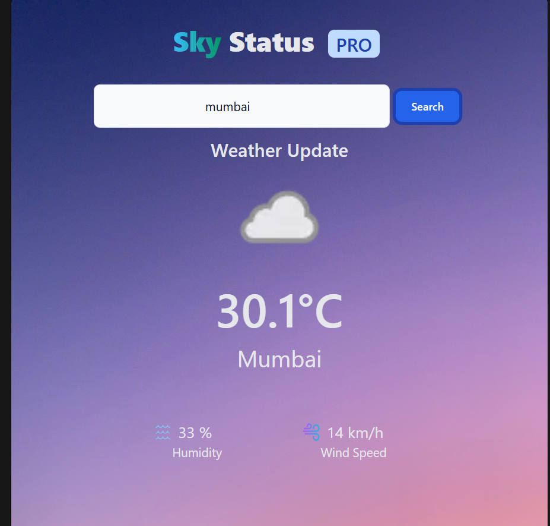

# 🌦️ Sky Status PRO - Live Weather App  

Sky Status PRO is a sleek and responsive weather app that provides real-time weather updates for any city. Built with **JavaScript, HTML, Tailwind CSS, and an API**, this app fetches live weather data and displays key weather details.  

  

## 🌟 Features  

✅ **Live Weather Data** – Get real-time weather updates for any city.  
✅ **Beautiful UI** – Responsive design with **Tailwind CSS**.  
✅ **Dynamic Background** – Changes based on weather conditions.  
✅ **Temperature, Humidity & Wind Speed** – All essential details in one place.  
✅ **API Integration** – Fetches live data from a weather API.  

---

## 🛠️ Tech Stack  

- **HTML**  
- **Tailwind CSS**  
- **JavaScript**  
- **Weather API**  

---

## 🚀 Live Demo  

🔗 **[Try the Live App Here](http://watery-distrizabution.surge.sh/)**  

---

## 📥 Installation & Usage  

1. **Clone the repository:**  
   ```sh
   git clone https://github.com/Sangeeth722/skyStatusPro.git
   cd weather-app
